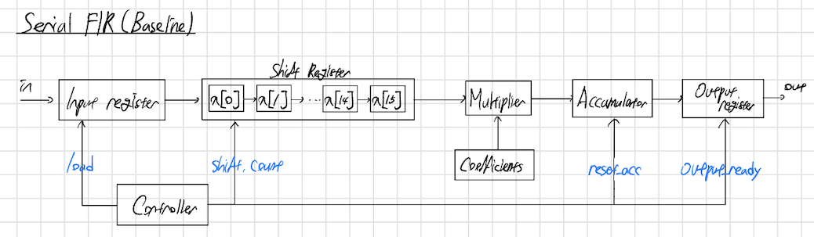
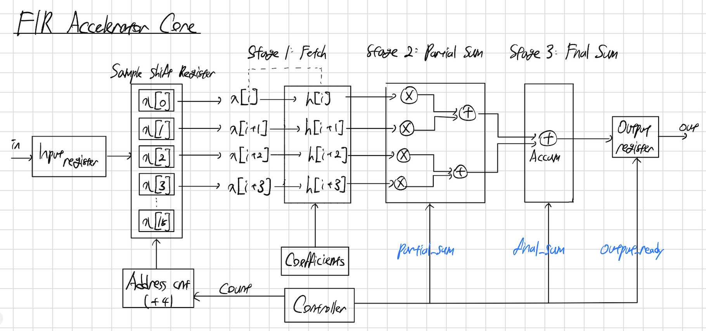
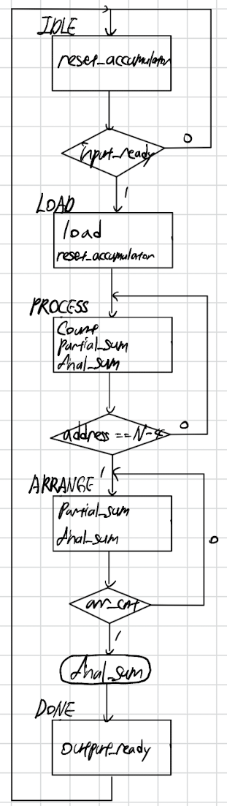

# FIR-Accelerator
## Introduction
Finite Impulse Response (FIR) filters are widely used in digital signal processing applications. However, conventional serial architecture has limited throughput due to sequential operations.

This project implements a parameterized pipelined FIR filter accelerator with an AXI4-Stream interface to improve filter performance. A bansline serial FIR core is developed into a 4-way parallel and pipelined architecture. 

The designs were verified using identical low-pass filter coefficients, and performance and resource trade-offs relative to the serial architecture were analyzed by comparing LUT, FF, and DSP resource usage, maximum operating frequency (Fmax), latency, and throughput based on FPAG synthesis results.

## Architecture Overview
The design consists of a baseline serial FIR structure and extended 4-way parallel/pipelined FIR accelerator architecture.

### Serial FIR
The baseline design is implemented as a serial FIR architecture using a sequential MAC (Multiply-Accumulate). Input samples are updated every clock cycle through a shift register, and a single accumulator is used to sequential filter operations. 

Each output is controlled by a state machine. Since all tap operations are performed sequentially, hardware utilization is low, but thorughput is limited.

### 4-way Parallel / Pipelined FIR Accelerator

The developed FIR accelerator is designed based on an expanded serial architecture into 4-way parallel data process and a pipelined MAC.

It fetches 4 input samples and 4 coefficients simultaneously to calculate partial sum by utilizing a 2-stage pipeline to reduce operation latency. 

- Stage 1: Fetch 4 samples and 4 coefficients
- Stage 2: Partial multiplication and accumulation
- Stage 3: Final accumulation and output scaling

In addition, the design reduces loop iterations by increasing the address counter by 4 and manages pipeline execution using control signals for partial and final sums.

## Implementation Details
### AXI4-Stream Interface
The design uses AXI4-Stream interface for both input and output, with internal FIFO buffers to separate streaming I/O from computation and support backpressure.

### Parameterized FIR Filter
It is a scalable design by chaning the number of taps such as 16, 32, and 64 through parameters. Low-pass and high-pass are implemented by changing coefficient sets without modifying RTL logic.

### 4-Way Parallel MAC Architecture
A 4-sample parallel structure is used to accelerate convolution.

Each cycle computes:

- 4 multiplication
- 2 partial sums
- 1 accumulation stage

This reduces the number of iterations by approximately 4x compared to a serial FIR.

### Accelerator Core ASM

### Fixed-point Scaling
Final output is scaled using an arithmetic shift to compensate for fixed-point coefficient scaling.

## 16-Tap FIR FPGA Synthesis Results
| Design | LUT | FF | DSP | Fmax (MHz) | Latency (cycles) | Throughput (MS/s) |
|--------|-----|----|-----|-------------|------------------|-------------------|
| Serial FIR | 35 | 24 | 1 | 149.72 | 18 | 8.32 |
| FIR Accelerator | 159 | 191 | 4 | 118.51 | 8 | 14.81 |

DSP usage increases 4x due to the 4-way parallel architecture. Latency is reduced by ~55%, while throughput increases by ~78%. Fmax decreases by ~21% due to increased critical path delay.

## Conclusion
DSP usage increases 4x due to the 4-way parallel architecture. Latency is reduced by approximately 55%, while throughput increases by approximately 78%. Fmax decreases by approximately 21% due to increased critical path delay.

- Conclusion

The FIR accelerator demonstrates a clear trade-off between resource utilization and performance. While the usage of LUT, FF, and DSP increases due to the 4-way parallel architecture, the design achieves improved throughput and reduced latency compared to the serial FIR. 

Although Fmax decreases due to increased critical path delay, the overall system performance is improved in terms of samples processed per second.
